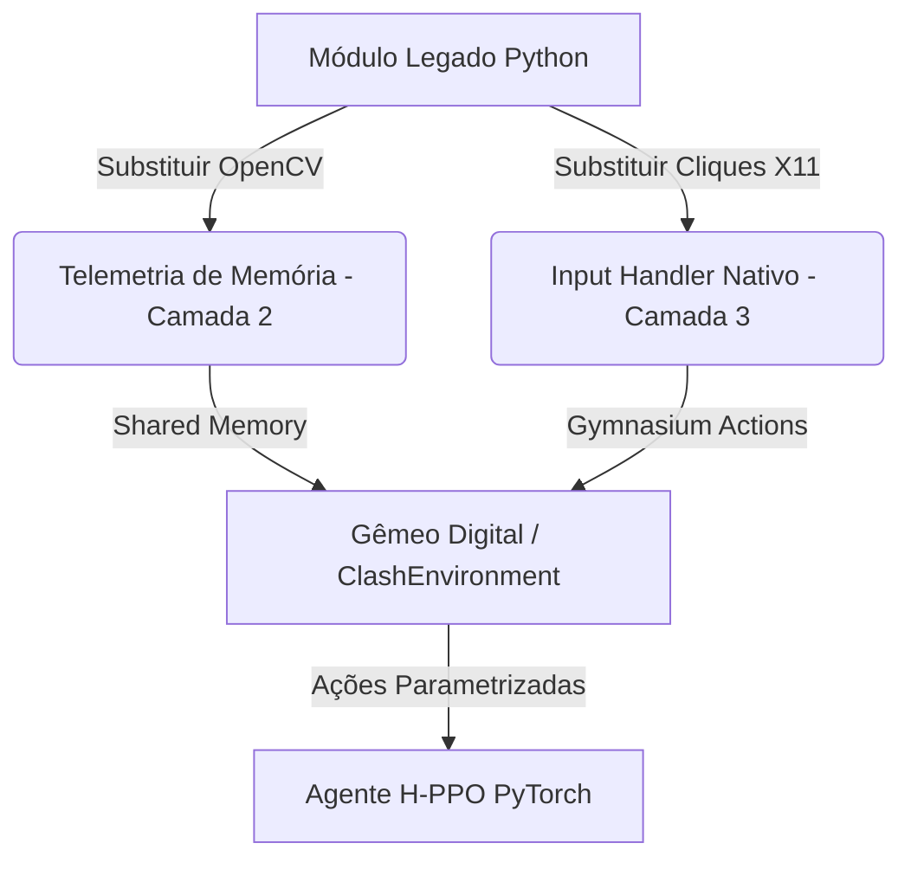

# Mapeamento de Arquivos: Transição Tecnológica (Automação Visual vs. Gêmeo Digital)

Este documento descreve a separação dos arquivos legados (comitados) e dos novos arquivos da nova tecnologia (injeção de código nativo, telemetria de memória e inteligência por aprendizado por reforço). Ele serve como um guia para futuras adaptações da lógica antiga para a nova infraestrutura.

---

## 1. Visão Geral da Mudança Tecnológica

- **Tecnologia Legada (Automação Visual):** Baseada em detecção de tela via OpenCV (template matching), controle de janela via X11/Mutter e simulação física de cliques/arrastes na tela. Possui desvantagens como lentidão, instabilidade perante mudanças de interface e dependência de foco da janela.
- **Nova Tecnologia (Gêmeo Digital & RL):** Baseada em injeção de código nativo C++20 na `libg.so`, hooking de funções com relocalização de instruções (ARM64/x86_64), leitura forense da Heap (Scudo Allocator) para detecção instantânea de entidades, barramento de comunicação IPC Zero-Copy (via Shared Memory e UNIX Sockets) e tomada de decisão via agente de Aprendizado por Reforço (RL) com PyTorch (H-PPO) e Gymnasium.

---

## 2. Inventário de Arquivos

### A. Arquivos Legados / Comitados (Automação Visual)
Estes são os arquivos que representam o motor antigo de automação. Eles serão gradualmente substituídos ou adaptados para consumir dados da nova telemetria e controlar o jogo de forma nativa.

| Arquivo/Diretório | Tipo | Descrição | Status / Destino na Nova Tecnologia |
| :--- | :--- | :--- | :--- |
| `main.py` | Script Python | Ponto de entrada do fluxo antigo de automação (loop de ataques sequenciais). | Será adaptado para rodar o loop de treinamento ou inferência do agente de RL (`gym.Env`). |
| `gui.py` | Interface Python | Interface gráfica antiga em PySimpleGUI para controlar presets de ataques. | Será adaptado para gerenciar configurações do agente de RL e exibir status do Gêmeo Digital (Grid 2D). |
| `config/constants.py` | Configuração | Constantes de coordenadas de tela, cores e tempos. | Será obsoleto para detecção visual, mas reaproveitado para IDs de tropas e tabelas de tipos. |
| `attacks/attack_utils.py` | Módulo Python | Funções utilitárias de ataque (ex: coletar carrinho, hotbar, castelo). | Serão convertidas em ações estruturadas ou recompensas no ambiente Gymnasium. |
| `attacks/builder_base.py` | Módulo Python | Algoritmos de ataque específicos para a Base do Construtor. | Serão convertidos em políticas específicas ou modelos H-PPO. |
| `attacks/home_base.py` | Módulo Python | Algoritmos de ataque específicos para a Vila Principal. | Serão convertidos em políticas específicas ou modelos H-PPO. |
| `utils/image_recognition.py`| Módulo Python | Reconhecimento de imagens via OpenCV (Template Matching). | **Substituído** pela detecção de entidades via leitura direta de memória/Heap na Camada 2. |
| `utils/mouse_actions.py` | Módulo Python | Simulação física de cliques e movimentos de mouse na janela. | **Substituído** por comandos de input nativos ou simulações lógicas nas coordenadas normais do mapa. |
| `utils/stop_handler.py` | Módulo Python | Escuta teclas ou interrupções para parar a execução física do bot. | Adaptado para gerenciar interrupções graciosas no loop do Gymnasium. |
| `utils/xlib_mutter_xauth.py`| Módulo Python | Interação com janelas X11/Mutter e obtenção de autorização xauth. | Não será mais necessário para automação, pois a telemetria roda direto no processo guest. |
| `carrinho/` <br> `images/carrinho/` | Imagens (PNG) | Imagens de referência de botões/elementos para o OpenCV. | **Obsoletas**. Não serão mais necessárias devido à leitura de memória. |
| `presets.json` | Configuração | Arquivo ignorado no Git contendo configurações personalizadas de tropas/ataques. | Será adaptado para configurar hiperparâmetros de treinamento e composição do exército de RL. |
| `pyproject.toml` / `uv.lock` | Dependências | Gerenciamento de dependências Python (atualmente focado em OpenCV, PyAutoGUI, etc). | Atualizado para incluir bibliotecas de RL e IA (`torch`, `gymnasium`, `numpy`). |

---

### B. Arquivos Novos (Gêmeo Digital & Instrumentação)
Arquivos introduzidos para suportar a injeção nativa, telemetria de memória e o Gêmeo Digital.

| Arquivo/Diretório | Tipo | Descrição |
| :--- | :--- | :--- |
| `CMakeLists.txt` | Build System | Configuração de build cross-platform para compilar a biblioteca nativa C++. |
| `digital_twin.md` | Documentação | Especificação técnica completa da arquitetura do Gêmeo Digital (Camadas 1 a 4). |
| `native/include/layer1_native_hook.hpp` | Header C++ | Definição da Camada 1: Engine de Syscalls brutas e Hooking ARM64/x86_64. |
| `native/src/layer1_native_hook.cpp` | Código C++ | Implementação da infraestrutura de injeção de hooks na memória da `libg.so`. |
| `native/src/main_test_layer1.cpp` | Código C++ | Arquivo de teste da instrumentação da Camada 1. |
| `native/include/layer2_forensic_heap.hpp` | Header C++ | Camada 2: `VTableResolver` (identificação de entidade por vptr em O(1)), travessia de contêineres libc++ (`LibcxxVector`/`LibcxxSharedPtr`) e `ScudoAuditor` (validação de cabeçalho de chunk do Scudo). Header-only. |
| `native/include/layer3_ipc_bridge.hpp` | Header C++ | Camada 3 (lado servidor): `ZeroCopyIPCServer` — cria `memfd`, faz o handshake `SCM_RIGHTS` e publica frames com double-buffering. Structs `TelemetryEntityData`/`SharedBufferFrame`/`SharedMemoryControlBlock` espelham byte a byte o lado Python. Header-only. |
| `native/src/middleware_main.cpp` | Código C++ | **Aplicação middleware que roda dentro do Waydroid** — junta Camadas 1-3 num servidor nativo de longa duração que faz a ponte jogo↔host Python. Executável `coc_dt_middleware`. |
| `utils/digital_twin_paths.py` | Módulo Python | Fonte única do caminho do socket IPC (`DEFAULT_SOCKET_PATH`), sem dependências pesadas. Ver Seção 5. |
| `utils/ipc_receiver.py` | Módulo Python | Receptor IPC Zero-Copy (Camada 3, **arquitetura A / injetada**): conecta via Unix Domain Socket, recebe o FD da Shared Memory via `SCM_RIGHTS`, mapeia o `SharedMemoryControlBlock` com `ctypes`/`mmap` e expõe `read_latest_telemetry()` retornando `(sequence, ndarray)`. **Inviável na prática** — depende do middleware injetado, que o anti-tamper do CoC detecta (ver `pesquisa/06`). Mantido pelo `TELEMETRY_DTYPE`, reusado pela arquitetura B. |
| `utils/defense_data.json` | Dados | Stats de todas as defesas do CoC por nível (HP, DPS) e por prédio (alcance, splash, alvos ar/terra, velocidade, footprint, alcance mínimo). Gerado do `buildings.csv` dos gamefiles; `data-id = 1000000 + índice` (confirmado por RE). 12 defesas da vila principal + 13 da base do construtor. |
| `utils/defense_stats.py` | Módulo Python | Loader/consulta do `defense_data.json`: `is_defense()`, `get_defense()`, `stats_at_level(data_id, level)`, `name_pt()`, `targets_air()`, `is_splash()`, `all_defense_ids()`. Fonte de verdade de stats para o atuador e o agente de RL cruzarem com a telemetria (que dá `data_id`/`level`). Ver `pesquisa/07_defesas.md`. |
| `utils/troop_data.json` | Dados | Stats de todas as tropas por nível (HP, DPS) e por tropa (espaço de acampamento, velocidade, voadora?, alcance, splash, ataca ar/terra, alvo preferido). Gerado do `characters.csv`; `data-id = 4000000 + índice`. 50 tropas da vila principal + 11 do construtor. |
| `utils/troop_stats.py` | Módulo Python | Loader/consulta do `troop_data.json`: `is_troop()`, `get_troop()`, `stats_at_level(data_id, level)`, `name_pt()`, `is_flying()`, `is_ranged()`, `all_troop_ids()`. Espelha `defense_stats.py`. Ver `pesquisa/08_tropas.md`. |
| `utils/external_receiver.py` | Módulo Python | **Receptor via LEITOR EXTERNO (arquitetura B — a que funciona)**. `ExternalMemoryReceiver` expõe a mesma interface `read_latest_telemetry()` do `ZeroCopyIPCReceiver`, mas lê a memória do jogo **de fora** (passivo, não detectável) invocando `~/.local/share/coc-digital-twin/mem_reader.py --json` via `sudo` (regra NOPASSWD). Converte data-id→tipo genérico (defesa/recurso/tropa), posição já em tiles. Plugado no `ClashDigitalTwinEnv` sem alterar o resto do pipeline de RL. Ver Seção "Arquitetura B" e `pesquisa/02`. |
| `utils/clash_env.py` | Módulo Python | Ambiente Gymnasium (Camada 4): `ClashDigitalTwinEnv` consome `ZeroCopyIPCReceiver` e converte telemetria em observação estruturada (grid multicanal `4×N×N` + vetor de estado global). **Somente leitura/observação** — não aciona nenhum input real no jogo. |
| `utils/hppo_network.py` | Módulo Python | Rede Ator-Crítico Híbrida (Camada 4): `ActorCriticHybridNetwork` (H-PPO) sobre a observação do ambiente. Depende de `torch`. |

---

## 3. Plano de Adaptação (Passo a Passo)

A transição deve ser feita de forma incremental para não quebrar a lógica de negócio já desenvolvida nos arquivos legados.



### Passo 1: Adaptar `config/constants.py`
Substituir os offsets físicos de tela por mapeamento de dados da memória. As constantes de IDs de tropas e edifícios da `libg.so` devem ser importadas aqui para que possam mapear os bytes lidos da Heap.

### Passo 2: Criar o Receptor IPC em Python (`utils/ipc_receiver.py`) — ✅ Concluído
Classe `ZeroCopyIPCReceiver` portada da Camada 3 do `digital_twin.md` para `utils/ipc_receiver.py`. Detalhes da implementação:

- **Structs `ctypes`**: `TelemetryEntityData`, `SharedBufferFrame` (double-buffer de 1024 entidades) e `SharedMemoryControlBlock` replicam byte a byte os `#pragma pack(push, 1)` do header C++ (`Layer3_IPC_Bridge.hpp`).
- **Handshake**: `connect_and_map()` conecta ao Unix Domain Socket (`AF_UNIX`), recebe o File Descriptor da região `memfd_create` via mensagem de controle `SCM_RIGHTS` (`recvmsg` + `CMSG_LEN`) e faz `mmap.mmap(shm_fd, ..., PROT_READ)` — leitura somente, já que a escrita é exclusiva do lado nativo.
- **Leitura zero-copy**: `read_latest_telemetry()` lê `active_write_buffer` (índice do buffer pronto para leitura, análogo ao double-buffering lock-free da Camada 3) e usa `np.frombuffer` diretamente sobre o `mmap` para materializar as entidades como `ndarray` estruturado (`TELEMETRY_DTYPE`), sem copiar memória.
- **Diferença em relação ao protótipo do `digital_twin.md`**: o offset das entidades (`entities_offset`) foi generalizado via constante `_ENTITIES_HEADER_SIZE` (calculada a partir do `sizeof` dos campos do cabeçalho do frame) em vez do valor mágico `+ 24` hardcoded no exemplo original, evitando dependência implícita do layout exato da struct.
- **Gestão de recursos**: implementa `close()` e o protocolo de context manager (`__enter__`/`__exit__`) para garantir que o `mmap` e o socket sejam liberados corretamente.

Próximo consumidor: a classe `ClashDigitalTwinEnv` do Passo 3 receberá uma instância de `ZeroCopyIPCReceiver` como `ipc_receiver` para popular as observações do ambiente Gymnasium.

### Passo 3: Criar o Ambiente do Gymnasium (`utils/clash_env.py`) — ✅ Concluído
Classe `ClashDigitalTwinEnv` portada da Camada 4 do `digital_twin.md` para `utils/clash_env.py`. Detalhes da implementação:

- **Observação**: `_get_observation()` lê o frame mais recente via `ipc_receiver.read_latest_telemetry()` e popula um tensor `grid` de 4 canais (`GRID_CHANNELS × grid_size × grid_size`) — HP de defesas (canal 0), densidade de tropas (canal 2) e recursos (canal 3) — além de um vetor `global_state` reservado (10 posições).
- **Espaços**: `observation_space` como `spaces.Dict` com `grid` (`Box` float32 `[0,1]`) e `global_state`; `action_space` como PAMDP híbrido (`Discrete(10)` para tipo de tropa + `Box(2)` para coordenadas normais `(X, Y)`), fiel à especificação da Camada 4.
- **`reset` / `step`**: seguem a interface padrão `gymnasium.Env`. A recompensa é derivada da variação percentual de destruição (`Δdestruction × 100`), calculada a partir do canal 0 do grid (HP de defesas zerado = destruída).

### Passo 4: Adaptar as Ações de Ataque (`attacks/`) — ✅ Concluído
Criado `attacks/deploy_policy.py`, que converte a lógica de deploy (posição de tropas, ordem de soltura) de `attacks/home_base.py`, `attacks/attack_utils.py` e `attacks/builder_base.py` em sequências de ações PAMDP compatíveis com `action_space` de `ClashDigitalTwinEnv` (`Discrete(10)` para tipo de tropa + `Box(2)` para coordenadas normalizadas `(X, Y)` em `[0.0, 1.0]`). Detalhes da implementação:

- **`DeployAction`**: dataclass imutável `(type: int, coords: np.ndarray, wait_after: float)`. O método `as_gym_action()` retorna o dicionário `{"type": ..., "coords": ...}` no formato exato aceito por `env.step()`. `sequence_to_gym_actions()` achata uma lista de `DeployAction` para uma lista desses dicionários.
- **Normalização de coordenadas**: `pixel_to_normalized()` converte os pontos fixos em pixels de `config/constants.py` (`BOTOES`, `CANTOS`, `RETAS`) para `[0.0, 1.0]^2`, assumindo os limites de tela `SCREEN_WIDTH = 900.0` / `SCREEN_HEIGHT = 500.0` (calibrados a partir do maior valor observado nas coordenadas legadas, ex.: `posicionar_tropa = (866, 276)`, `selecionar_tropa_9 = (632, 480)`). Caso a resolução real da janela do emulador mude, essas duas constantes devem ser recalibradas.
- **Mapeamento do tipo discreto (`Discrete(10)`)**: `troop_slot_type(slot_index)` mapeia os botões `selecionar_tropa_1..selecionar_tropa_9` (1-indexados) para `type_id` 0-indexado (`0..8`). O índice `9` (`HERO_TYPE_ID`) é reservado para heróis e poções, que na lógica legada não têm um "tipo" fixo — são selecionados via botão dinâmico armazenado em `army[<heroi>]['sel']` (calculado por `ajustar_hotbar` em `attack_utils.py`). Essa é uma simplificação deliberada: o PAMDP da Camada 4 usa um único `Discrete(10)`, então heróis/poções compartilham o mesmo tipo discreto e se diferenciam apenas pela posição/ordem na sequência.
- **`build_dragon_sequence(army)`**: porta `attacks.home_base.ataque_dragao` — afunilamento (rei/máquina de cerco), tropa principal em `posicao_dragao_1..15`, poções de fúria e ativação de heróis, preservando a ordem e os `wait_after` originais (`8s` após posicionar a tropa/rainha, `12s` antes das últimas poções).
- **`build_goblin_sequence(army)`**: porta `attacks.home_base.ataque_goblin` — heróis no canto `C`, tropas ao longo das 4 `RETAS` via a réplica local de `gerar_pontos_na_reta`, com as poções/heróis extras acionados nas retas de índice 2 e 3 (fiel ao `if i == 2` / `if i == 3` do original). **Observação de bug legado**: o código original chama `clicar('selecionar_tropa_0')`, botão que não existe em `BOTOES` (o clique falharia silenciosamente em produção); interpretado aqui como a intenção de posicionar o primeiro slot de tropa (`type_id = 0`).
- **`build_rapid_sequence(army, tropas_por_reta=None)`**: porta `attacks.home_base.ataque_rapido` — heróis nos 4 cantos (`C`, `B`, `EC`, `DC`) seguidos da distribuição linear de tropas nas `RETAS`, usando a réplica local de `gerar_pontos_nao_aleatorios`. Adiciona uma guarda (`n_por_reta = max(n_por_reta, 2)`) para evitar divisão por zero no caso degenerado de menos de 2 tropas por reta, ausente no código original.
- **`build_builder_base_sequence()`**: porta `attacks.attack_utils.posicionar_tropa` (usada por `ganhar_uma`/`ganhar_duas`), posicionando os 8 primeiros slots de tropa em `(444, 360)`.
- **Decisão de dependência**: as funções `gerar_pontos_na_reta`/`gerar_pontos_nao_aleatorios` foram replicadas localmente em vez de importadas de `utils/mouse_actions.py`, pois esse módulo aplica o patch X11/Mutter e importa `pyautogui` só de ser carregado — dependência de display gráfico incompatível com um módulo de política que deve rodar sem cabeça (headless) durante o treinamento de RL.
- **Não aciona input real**: assim como `utils/clash_env.py`, este módulo é somente uma camada de tradução — não há chamada a `pyautogui`/`clicar`/`arrastar`. As sequências geradas servem como política com script (baseline/expert trajectories) para bootstrap ou avaliação comparativa do agente H-PPO.
- **Gap identificado (fora do escopo deste passo)**: `gymnasium`, `torch` e `numpy` ainda não constam em `pyproject.toml`/`uv.lock`, embora já sejam usados por `utils/clash_env.py` (Passo 3) e por este módulo. Fica pendente para o Passo 5 (ou uma atualização de dependências dedicada) adicionar essas bibliotecas ao gerenciador de pacotes.

Próximo consumidor: `main.py` (Passo 5) poderá usar `build_*_sequence` para gerar trajetórias de demonstração/expert antes de treinar o `ActorCriticHybridNetwork`, ou como política de fallback determinística enquanto o agente de RL ainda não está treinado.

### Passo 5: Atualizar `main.py` e `gui.py` — ✅ Concluído

- **Dependências**: adicionadas `numpy`, `gymnasium` e `torch` a `pyproject.toml`/`uv.lock` via `uv add` (fecha o gap identificado no Passo 4). São todas importadas de forma lazy (dentro de funções/módulos específicos do Gêmeo Digital), então o fluxo legado de automação visual (`pyautogui`, `keyboard`, X11) continua funcionando sem precisar delas instaladas.
- **`utils/hppo_network.py`** (novo): porta `ActorCriticHybridNetwork` da Camada 4 do `digital_twin.md`. Isolado em módulo próprio (em vez de dentro de `utils/clash_env.py`) porque depende de `torch`, enquanto o ambiente Gymnasium deve continuar utilizável apenas para observação/telemetria sem exigir PyTorch instalado. Também expõe `observation_to_tensors(obs)`, que converte a observação `dict` (arrays NumPy) do `ClashDigitalTwinEnv` em tensores `torch` com batch dimension 1, evitando repetir esse boilerplate em cada consumidor.
- **`main.py` — `iniciar_gemeo_digital(config)`** (nova função, paralela a `iniciar_bot`): conecta `ZeroCopyIPCReceiver` (Camada 3) via `with`, instancia `ClashDigitalTwinEnv` e `ActorCriticHybridNetwork`, e roda um loop de `passos` chamadas a `env.step()` amostrando ações da rede a cada passo, imprimindo ação/valor estimado `V(s)`/recompensa. Aceita `config` com `socket_path`, `grid_size` e `passos`.
  - **Modo "sombra" deliberado**: assim como `utils/clash_env.py` e `attacks/deploy_policy.py`, esta função **não aciona nenhum input real no jogo** — ela só lê a telemetria e amostra ações para fins de observação/depuração/treinamento. A ponte entre a ação amostrada pela rede e um atuador nativo (Camada 1, hooking/injeção) ainda não existe neste repositório; construí-la está fora do escopo deste passo e é o próximo item natural do roadmap.
  - Mantida separada de `iniciar_bot` (que continua controlando exclusivamente os modos 1–6 de automação visual) em vez de virar mais um `modo`, porque as duas funções têm dependências, formatos de `config` e ciclos de vida (loop de ataques físicos vs. loop de inferência sobre telemetria) fundamentalmente diferentes.
- **`gui.py` — nova aba "Gêmeo Digital"**: terceira aba em `COCBotGUI`, somente leitura, com:
  - Campo `entry_socket_path` (padrão `/tmp/coc_dt.sock`) e botões `Conectar Telemetria` / `Desconectar`.
  - `_conectar_gemeo_digital()`: importa `ZeroCopyIPCReceiver` de forma lazy (evita exigir NumPy quando a aba não é usada), conecta e mapeia a memória compartilhada, e inicia uma thread daemon (`_loop_polling_gemeo_digital`) que lê `read_latest_telemetry()` a cada 0.5s.
  - `_formatar_telemetria()`: renderiza o frame ativo (sequência + até 50 entidades com tipo/posição/HP%) na `CTkTextbox` `text_gemeo_digital`, seguindo o mesmo padrão de status colorido (`label_status_gemeo`) já usado nas outras abas.
  - `_desconectar_gemeo_digital()` fecha o `mmap`/socket do receptor (`receiver.close()`) e para a thread de polling.
  - `_ao_fechar()` registrado em `self.protocol("WM_DELETE_WINDOW", ...)` garante que a conexão IPC seja liberada mesmo se o usuário fechar a janela sem clicar em "Desconectar" — anteriormente não havia handler de fechamento nenhum.
  - Optou-se por uma lista textual de entidades em vez de desenhar o grid `4×N×N` como uma imagem/canvas: é suficiente para depuração (ver contagem, posição e HP de cada entidade lida da Heap em tempo real) e evita puxar uma dependência de plotting (ex.: Pillow para renderizar arrays NumPy) só para a GUI.

Com isso, os cinco passos do plano de adaptação (`digital_twin.md` → Camadas 1–4) descritos neste documento estão implementados no lado Python (Camadas 3 e 4) e a lógica de deploy legada (Camadas de automação visual) tem uma tradução completa para o espaço de ações do Gymnasium. A lacuna restante, registrada acima, é a integração real entre a Camada 1 (injeção nativa C++) e um atuador que aplique as ações do agente de volta ao jogo — hoje as Camadas 1/2 (`native/`) existem como infraestrutura de hooking/heap-walk em C++, mas nenhum caminho native → input ainda foi conectado ao loop Python.

---

## 4. Verificação de Integração (arquivos novos)

Auditoria de que os arquivos novos (Camadas 1, 3 e 4 do lado Python + build nativo da Camada 1) realmente se encaixam logicamente. Metodologia e achados:

### 4.1. Build nativo (Camada 1)
`cmake -S . -B build_check && cmake --build build_check` compila `layer1_native_hook` (biblioteca estática) e `main_test_layer1` com sucesso em Linux x86_64, e o executável roda sem crash. **Confirmado que compila**, mas é apenas o teste de hooking em si (endereços fake dentro do próprio binário de teste) — não há, ainda, nenhum arquivo `native/` implementando as Camadas 2 (heap walk / Scudo) ou 3 (`Core::IPC::ZeroCopyIPCServer`); elas só existem como blocos de código dentro de `digital_twin.md`. Isso significa que **hoje não existe nenhum processo nativo real que produza telemetria** — os consumidores Python (`ipc_receiver.py`, `clash_env.py`, `hppo_network.py`, a aba "Gêmeo Digital" da GUI) só funcionam contra um servidor C++ que ainda precisa ser escrito.

### 4.2. Simulação do protocolo de wire (Camada 3) e dois bugs corrigidos
Para validar o protocolo binário Python↔nativo sem depender do servidor C++ (inexistente), foi escrito um servidor Python descartável (`fake_native_server.py`, fora do repositório) que replica exatamente o handshake da Camada 3: abre um fd de memória compartilhada, escreve um `SharedMemoryControlBlock` serializado byte a byte igual ao layout de `Layer3_IPC_Bridge.hpp`, e o transfere via `SCM_RIGHTS` sobre um Unix Domain Socket. Isso expôs dois bugs reais em `utils/ipc_receiver.py` que teriam quebrado **qualquer** conexão com um servidor nativo real, mesmo que ele existisse e estivesse correto:

1. **`connect_and_map()` sempre falhava com `TypeError: underlying buffer is not writable`.** A causa: o mmap era aberto com `PROT_READ` (correto, o cliente é somente leitura), mas em seguida `SharedMemoryControlBlock.from_buffer(self.shm_buf)` — `ctypes.Structure.from_buffer()` exige um buffer *gravável*, mesmo que a intenção seja só ler. **Corrigido**: removida a vinculação via `ctypes.from_buffer`; `magic`/`active_write_buffer` e os cabeçalhos de frame (`sequence`/`timestamp_ns`/`entity_count`) agora são lidos com `struct.unpack_from()` diretamente sobre o mmap a cada chamada de `read_latest_telemetry()`, preservando a leitura ao vivo (double-buffering) sem exigir um buffer gravável. `SharedMemoryControlBlock`/`SharedBufferFrame` continuam existindo só para `ctypes.sizeof()` (cálculo de offsets).
2. **Race condition em `gui.py`**: `read_latest_telemetry()` devolve um `ndarray` que é uma *view* zero-copy sobre o mmap (via `np.frombuffer`). Se a thread de polling (`_loop_polling_gemeo_digital`) ainda tiver essa view viva na pilha quando a thread principal chama `receiver.close()` (botão "Desconectar" ou fechar a janela), `mmap.close()` levanta `BufferError: cannot close exported pointers exist`. Reproduzido deterministicamente com um teste que inicia o polling, dá tempo da thread capturar uma referência e então desconecta. **Corrigido**: `_desconectar_gemeo_digital()` agora faz `self._thread_gemeo.join(timeout=2.0)` antes de `receiver.close()`, garantindo que a última referência local ao array tenha saído de escopo. `ZeroCopyIPCReceiver.close()` ganhou um docstring documentando essa armadilha para quem escrever novos consumidores.

Depois das correções, o teste ponta a ponta (`fake_native_server` → `ZeroCopyIPCReceiver` → `ClashDigitalTwinEnv.reset()/step()` → `main.iniciar_gemeo_digital()`) roda sem exceções e devolve telemetria correta (posições, HP%, contagem de entidades) idêntica ao que foi escrito na memória compartilhada simulada.

### 4.3. Bug de contrato de ação corrigido (Camada 4)
`ActorCriticHybridNetwork.sample_action()` (portado literalmente do pseudocódigo de `digital_twin.md`) amostra o componente contínuo de uma `Normal(mean, std)` sem truncar — com `continuous_log_std` inicializado em zero, `std = 1.0`, muito maior que o intervalo `[0, 1]` esperado por `coords`. Teste com `action_space.contains()` confirmou que a ação amostrada cai fora de `Box(0.0, 1.0)` em boa parte das chamadas (valores observados como `1.72`, `-0.30`, `2.22`). **Corrigido**: adicionado `torch.clamp(continuous_action, 0.0, 1.0)` antes de devolver a ação. Reteste com 200 amostras: 0 ações inválidas.

### 4.4. Checagens de consistência confirmadas (sem bugs)
- `attacks/deploy_policy.py`: as quatro sequências (`build_dragon_sequence`, `build_goblin_sequence`, `build_rapid_sequence`, `build_builder_base_sequence`) geram exclusivamente ações válidas em `spaces.Dict({"type": Discrete(10), "coords": Box(0,1,shape=(2,))})` — testado com `action_space.contains()` sobre todas as ações de cada sequência.
- `utils/hppo_network.py` × `utils/clash_env.py`: `GRID_CHANNELS`/`GLOBAL_STATE_DIM` são importados de `clash_env.py` (não duplicados), e o cálculo de `conv_out_size = 32 * (grid_size // 2) * (grid_size // 2)` bate com a arquitetura real da CNN (um único `MaxPool2d(2)`), validado para `grid_size=10` e `grid_size=50`.
- `main.py` (`iniciar_gemeo_digital`) e `gui.py` (aba "Gêmeo Digital") usam o mesmo `socket_path` padrão e a mesma classe `ZeroCopyIPCReceiver`, mantendo consistência entre o caminho de inferência (CLI) e o de observação (GUI) — ver Seção 5 sobre a centralização desse caminho.

### 4.5. Conclusão
O lado Python (Camadas 3 e 4 + `attacks/deploy_policy.py` + GUI) agora está internamente consistente e foi validado ponta a ponta contra um simulador do protocolo nativo, com dois bugs de correção real corrigidos. A limitação estrutural permanece a mesma do Passo 5: **não existe ainda nenhum servidor nativo C++ (Camadas 2/3) rodando de verdade** — os arquivos novos "funcionam juntos" no sentido de que o contrato de dados e o fluxo de chamadas estão corretos, mas o pipeline completo só passa a operar contra o jogo real quando o servidor `Core::IPC::ZeroCopyIPCServer` (hoje só em `digital_twin.md`) for de fato implementado em `native/` e o `main_test_layer1`/hooking da Camada 1 for estendido para escrever telemetria real (Camada 2) nesse buffer.

---

## 5. Caminho do Socket IPC preparado para Waydroid

Contexto: o emulador recomendado para rodar este projeto no Fedora é o Waydroid (container LXC, kernel compartilhado com o host, melhor integração Wayland). Isso introduz um problema de namespace que não existia quando o socket era só um caminho hardcoded em três lugares: **o guest Android (dentro do Waydroid) e o host Fedora têm `/tmp` separados** — um socket criado em `/tmp/coc_dt.sock` dentro do container não aparece em `/tmp` do host, então `ZeroCopyIPCReceiver.connect()` nunca o encontraria.

- **`utils/digital_twin_paths.py`** (novo): módulo sem dependências pesadas (só `os`), única fonte de verdade para o caminho do socket. Define `DEFAULT_SHARED_DIR = ~/.local/share/coc-digital-twin` e `DEFAULT_SOCKET_PATH = <DEFAULT_SHARED_DIR>/coc_dt.sock`. Isolado em módulo próprio (em vez de `config/constants.py`, que ainda é só automação visual legada, ou `utils/ipc_receiver.py`, que já importa `numpy`) justamente para que `gui.py` possa importar o caminho padrão **no nível de módulo** — e preencher o campo de socket antes mesmo de a aba "Gêmeo Digital" ser aberta — sem forçar a carga de `numpy` na inicialização da GUI.
- **`utils/ipc_receiver.py`**: `ZeroCopyIPCReceiver.__init__` agora usa `DEFAULT_SOCKET_PATH` importado de `digital_twin_paths` como valor padrão, em vez do literal `"/tmp/coc_dt.sock"` duplicado.
- **`main.py`**: `iniciar_gemeo_digital` importa `DEFAULT_SOCKET_PATH` (lazy, junto dos outros imports pesados) e usa `config.get('socket_path', DEFAULT_SOCKET_PATH)`.
- **`gui.py`**: importa `DEFAULT_SOCKET_PATH` no topo do arquivo (import leve, sem numpy) e usa para pré-preencher `entry_socket_path` e como fallback em `_conectar_gemeo_digital`, substituindo os dois literais `"/tmp/coc_dt.sock"` que existiam antes.
- Reexecutado o teste de integração ponta a ponta (Seção 4.2, com o `fake_native_server`) depois da mudança — continua passando, confirmando que a troca de default não quebrou o fluxo de conexão.

**Passo a passo para tornar o caminho visível dentro do Waydroid** (ação manual do usuário, específica da instalação — não algo que este repositório possa configurar sozinho): o diretório `DEFAULT_SHARED_DIR` no host precisa ser montado dentro do container LXC do Waydroid via bind mount, editando `/var/lib/waydroid/lxc/waydroid/config`:

```
lxc.mount.entry = /home/<usuario>/.local/share/coc-digital-twin data/media/0/coc-digital-twin none bind,create=dir,optional 0 0
```

**Validado na prática (2026-07-22)**: montar diretamente na raiz do container (`coc-digital-twin` sem prefixo) falha com `Read-only file system`, porque a raiz é montada a partir de `system.img` e é somente leitura — `create=dir` não consegue criar o ponto de montagem ali. O alvo precisa estar dentro de uma partição gravável, por isso `data/media/0/coc-digital-twin` (equivalente a `/sdcard/coc-digital-twin`). Além disso, essa linha é apagada toda vez que `waydroid init -f` regenera o `config`, precisando ser readicionada.

Isso expõe o diretório do host em `/data/media/0/coc-digital-twin` dentro do guest. A Camada 3 nativa (`Core::IPC::ZeroCopyIPCServer`) agora existe em `native/include/layer3_ipc_bridge.hpp` (ver Seção 6) e cria o socket em `/data/media/0/coc-digital-twin/coc_dt.sock` — o mesmo arquivo aparece no host em `DEFAULT_SOCKET_PATH` (`~/.local/share/coc-digital-twin/coc_dt.sock`), que é exatamente o que `ipc_receiver.py`, `main.py` e `gui.py` já esperam por padrão. O que ainda falta para o socket carregar dados *reais* do jogo (e não os sintéticos do stub) é o levantamento dos offsets de V-Table da `libg.so` — ver Seção 6 e a lista de TODOs para a IA.

---

## 6. Aplicação Middleware Nativa (Camadas 1-3 dentro do Waydroid)

O plano (`digital_twin.md`) descreve uma aplicação middleware que reside **dentro do guest** (o processo injetado no jogo) e faz a ponte com o host Python. Ela agora existe, unindo as três camadas nativas num único executável de longa duração, `coc_dt_middleware`:

- **`native/include/layer2_forensic_heap.hpp`** (Camada 2, header-only): `VTableResolver` identifica o tipo de um objeto em O(1) lendo o `vptr` no offset `0x0` e consultando um hash map de V-Tables conhecidas (`.rodata` da `libg.so`), sem RTTI. Inclui os leitores de contêiner libc++ (`LibcxxVector`, `LibcxxSharedPtr` com verificação de use-after-free via `shared_owners > 0`) e o `ScudoAuditor` para validar o cabeçalho de chunk do Scudo. **Nota de escopo documentada no header**: `ScudoAuditor` só faz sentido dentro de um processo Android/Bionic real (o cabeçalho de 8 bytes é criação do Scudo); em builds de host com glibc, chunks de `malloc()` comum não têm esse cabeçalho, então o teste de host não o exercita.
- **`native/include/layer3_ipc_bridge.hpp`** (Camada 3, header-only, lado servidor): `ZeroCopyIPCServer` faz `memfd_create` → `mmap(RW)` → `bind`/`listen` no Unix Domain Socket, e `AcceptClientAndSendFd()` transfere o FD da SHM ao cliente via `SCM_RIGHTS`. `WriteFrame()` implementa o double-buffering lock-free (escreve no buffer inativo, depois publica com `active_write_buffer.store(..., release)`). Os structs `#pragma pack(push,1)` são o **contrato binário** espelhado byte a byte em `utils/ipc_receiver.py` — mudar um campo aqui exige mudar lá.
- **`native/src/middleware_main.cpp`**: o executável em si. Resolve os limites de `.rodata` da `libg.so` lendo `/proc/self/maps` (fragmento da Camada 1), inicializa o `ZeroCopyIPCServer`, aceita o cliente Python e entra num laço ~60 FPS chamando `CollectEntities()` → `WriteFrame()`. **`CollectEntities()` é hoje um STUB**: emite uma entidade sintética (defesa, HP decaindo) porque a enumeração real das entidades depende dos offsets de V-Table da build específica da Supercell, que exigem engenharia reversa da `libg.so` (fora do que o código pode inferir sozinho). O stub existe para permitir validar o transporte host↔guest de verdade.
- **`CMakeLists.txt`**: novo alvo `coc_dt_middleware` (POSIX-only, linka `Threads::Threads` e a lib estática da Camada 1).

**Validação real (não simulada)**: compilado com `cmake --build` e executado como binário C++ nativo, com o `utils/ipc_receiver.py` real conectando como cliente. O receptor Python recebeu corretamente o frame publicado pelo middleware (sequência, entidade `id=1 type=1 pos=(25,25) hp=997/1000`) e o `ClashDigitalTwinEnv.reset()` populou o grid a partir dele — confirmando que o handshake `memfd`/`SCM_RIGHTS`, o layout binário e o double-buffering casam entre os dois lados. Diferente da Seção 4.2 (que usava um servidor Python fingindo ser nativo), aqui o produtor é o executável C++ real; só falta trocar o `CollectEntities` stub pela varredura de heap real para o pipeline operar contra o jogo.

O que resta para o pipeline ler o jogo de verdade está detalhado nas duas listas de tarefas abaixo (Seção 7).

---

## 7. Listas de Tarefas (o que falta para o pipeline operar contra o jogo real)

O código deste repositório está internamente consistente e validado ponta a ponta com dados sintéticos. Para operar contra o Clash of Clans real, faltam tarefas de **duas naturezas diferentes**: infraestrutura de ambiente (só um humano com acesso à máquina consegue fazer — instalar/rootar o Waydroid, mexer no LXC, aceitar riscos de ToS) e trabalho de engenharia de software (uma IA/dev pode fazer no código, exceto a parte que depende de artefatos extraídos do ambiente do humano).

**Dependência entre as listas**: a maior parte da Lista A (código) fica bloqueada até o humano concluir a Lista B, porque o passo crítico — descobrir os offsets de V-Table da `libg.so` — exige a `libg.so` real extraída do APK/dispositivo, que só existe depois que o humano instala o jogo no Waydroid.

### Lista A — Para uma IA / dev codar (no repositório)

- [ ] **Camada 1 — instalar hooks de verdade**: hoje `main_test_layer1.cpp` só testa o hooking sobre endereços fake dentro do próprio binário. Estender para instalar o trampoline sobre uma função real da `libg.so` (ex.: o tick de update do motor) e disparar a coleta de telemetria a cada frame, em vez do `sleep` fixo de 16.6 ms do stub em `middleware_main.cpp`.
- [ ] **Camada 1 — relocalização ADRP no caminho real**: exercitar `TrampolineARM64::PatchADRP` sobre o prólogo real da função hookada (o teste atual não cobre um prólogo com `ADRP`). Validar em ARM64 dentro do Waydroid, não só em x86_64 no host.
- [ ] **Camada 2 — registrar as V-Tables** (⚠ bloqueado pela Lista B): uma vez que o humano forneça a `libg.so` e os offsets extraídos, preencher os `resolver.RegisterClassVTable(base + offset, EntityType::...)` no `middleware_main.cpp` (há um `TODO` marcado no arquivo). Sem isso, `VTableResolver::IdentifyObject` sempre devolve `Unknown`.
- [ ] **Camada 2 — substituir o `CollectEntities` stub**: trocar a entidade sintética pela varredura real da heap: iterar os pools de objetos do motor, `IdentifyObject(ptr)` em cada vptr, e desreferenciar os campos (id, `pos_x`/`pos_y`, `current_hp`/`max_hp`, `level`, `state`) via os offsets de struct + `LibcxxVector`/`LibcxxSharedPtr`. Mapear cada `EntityType` da Camada 2 para o `type_id` genérico da telemetria (defesa=1/tropa=2/recurso=3).
- [ ] **Camada 2 — herança do Cookie do Scudo**: implementar a extração do Cookie global do Scudo (a struct `ScudoAuditor` já valida o cabeçalho, mas recebe o cookie pronto) para poder auditar ponteiros antes de desreferenciá-los e evitar `SIGSEGV`/crash por chunk corrompido durante a varredura.
- [ ] **Camada 3 — consumir o `eventfd` em vez de polling**: o servidor já sinaliza via `eventfd` a cada frame; o `ipc_receiver.py` hoje faz polling com `read_latest_telemetry()`. Adicionar um caminho `epoll`/`select` no lado Python para acordar só quando há frame novo (menor latência, menos CPU). Opcional, mas é o que a Camada 3 do plano prevê.
- [ ] **Cross-compilar o middleware para a ABI do Waydroid**: adicionar ao `CMakeLists.txt`/toolchain o alvo ARM64 (ou x86_64, conforme a imagem do Waydroid) via NDK, já que o `coc_dt_middleware` hoje só compila para o host. Definir como transformar o `.so`/executável em algo injetável no processo do jogo (a Camada 1 injeta, mas o empacotamento não está definido).
- [ ] **Atuador (Camada 1 → input)**: fechar a lacuna registrada desde o Passo 5 — traduzir a ação amostrada pelo `ActorCriticHybridNetwork` (ou pelas sequências de `attacks/deploy_policy.py`) em input real no jogo (deploy de tropa nas coordenadas normalizadas). Hoje todo o lado Python é somente leitura.
- [ ] **Teste de integração automatizado**: transformar a validação manual das Seções 4.2/6 num teste versionado (subir o `coc_dt_middleware`, conectar o receptor, asserir a telemetria) para pegar regressões no contrato binário C++↔Python.

#### Camada de Análise Tática (achar brechas na vila) — ver `pesquisa/09_analise_tatica.md`
Camada derivada entre a observação crua e o agente H-PPO; **só leitura + matemática** sobre dados já extraídos (posições + `defense_stats`/`troop_stats`), sem nova RE. Alimenta o RL com priors táticos, política heurística e reward shaping.
- [ ] **`utils/tactical_analysis.py` — mapa de ameaça**: `threat_ground`/`threat_air` por tile (Σ DPS das defesas vivas que alcançam o tile, respeitando `min_range`/alvos). É o "Canal 1" real do `digital_twin.md`. Base de todo o resto.
- [ ] **Zonas mortas e construções expostas**: tiles sem cobertura; prédios (esp. recursos) atacáveis a partir deles — "saque de graça" e ponto de entrada seguro.
- [ ] **Clusters de defesa vulneráveis a feitiço**: achar o disco de raio R (feitiço) que cobre mais DPS de defesa — o exemplo pedido das **Defesas Aéreas coladas** que um Relâmpago derruba junto (abre corredor aéreo). Max-coverage por disco (guloso).
- [ ] **Lado fraco / setores**: dividir a vila em setores a partir do centroide/TH, medir dureza defensiva de cada aproximação, achar a borda de menor DPS acumulado.
- [ ] **Canais derivados na observação**: plugar threat/gap/exposed/spell_value como canais extras no `_get_observation` do `clash_env` (feature engineering p/ a CNN/GNN).
- [ ] **Política heurística de baseline (curriculum/BC)**: Goblin→recurso exposto, Gigante/Hog→lado fraco, feitiço→melhor cluster. Bootstrap do RL + modo demo jogável.
- [ ] **Reward shaping + prior de ação**: bônus por explorar brecha certa; prior espacial `softmax(−threat + valor_de_brecha)` para o deploy no PAMDP.
- [ ] **`utils/spell_stats.py`** (dep. de dados): extrair `spells.csv` (data-id 26000000+) — raio, dano/nível, duração — no padrão de `defense_stats`/`troop_stats`, para quantificar o que cada feitiço desativa nos clusters.
- [ ] **Pathing/funil (fase 2)**: simular o alvo que cada tropa buscaria (vizinho mais próximo + `preferred_target_class`), detectar funis nas muralhas para escolher deploy que evita o "trilho".

### Lista B — Para um humano configurar (ambiente / Waydroid no Fedora)

- [x] **Instalar o Waydroid no Fedora**: `sudo dnf install waydroid` (ou o script oficial). Requer sessão Wayland. Inicializar com `sudo waydroid init` (variante `GAPPS` se quiser Play Store). *(Feito em 2026-07-22. No Fedora, o pacote não traz `/usr/share/waydroid-extra/channels.cfg`, então os canais de OTA ficam vazios por padrão — é preciso passar explicitamente `sudo waydroid init -f -s GAPPS -c https://ota.waydro.id/system -v https://ota.waydro.id/vendor`.)*
- [x] **Suporte a ARM (libhoudini/libndk)**: como o Fedora desktop é x86_64 e o Clash of Clans é ARM64, instalar a camada de tradução ARM via `waydroid_script` (`pip`/git: `casualsnek/waydroid_script` → `install libndk` ou `libhoudini`). Sem isso o jogo nem inicia. *(Feito em 2026-07-22, `libhoudini` — recomendado para CPU Intel; `libndk` é indicado para AMD. Instalado via `sudo venv/bin/python3 main.py install libhoudini` a partir de `~/waydroid_script`.)*
- [x] **Rootar o Waydroid**: instalar Magisk via `waydroid_script` (`install magisk`). Necessário para o middleware ter `ptrace`/`mprotect` sobre o processo do jogo e ler `/proc/<pid>/maps`. *(Feito em 2026-07-22, Magisk Delta via `sudo venv/bin/python3 main.py install magisk`.)*
- [ ] **Ajustar SELinux/permissões**: garantir que o processo injetado consiga chamar `process_vm_readv`/`ptrace` (pode exigir `setenforce 0` no host ou política dedicada, dependendo da config). Validar que `memfd_create` e `SCM_RIGHTS` funcionam dentro do container.
- [x] **Configurar o bind mount do socket** (ver Seção 5): criar `~/.local/share/coc-digital-twin` no host e adicionar a `lxc.mount.entry` em `/var/lib/waydroid/lxc/waydroid/config`, depois reiniciar o container (`waydroid session stop` / `sudo systemctl restart waydroid-container` / `waydroid session start`). Conferir que `/data/media/0/coc-digital-twin` aparece dentro do guest. *(Feito em 2026-07-22. Montar direto na raiz do container falha com `Read-only file system` — o alvo precisa ser `data/media/0/coc-digital-twin`, dentro da partição `/data` que é gravável; ver nota na Seção 5. Confirmado com `sudo waydroid shell -- ls -la /data/media/0/coc-digital-twin` enxergando um arquivo criado no host.)*
- [x] **Instalar o Clash of Clans**: via Play Store (imagem GAPPS) ou sideload de APK (`waydroid app install <apk>`). Fazer login e chegar até uma vila para ter estado real na memória. *(Instalado em 2026-07-22 via Play Store, dentro da UI do Waydroid.)*
- [ ] **Extrair a `libg.so` do jogo** (desbloqueia a Lista A): copiar a `libg.so` de dentro do container (`/data/app/.../lib/arm64/` ou do APK) para o host e disponibilizá-la para engenharia reversa dos offsets de V-Table. **Este é o artefato que a Lista A precisa e que só o humano consegue produzir.**
- [~] **Levantar os offsets de V-Table** (parcialmente concluído em 2026-07-22): identificar os endereços das V-Tables das classes de entidade e os offsets dos campos. **Feito sem Ghidra/IDA e sem Frida** (o CoC detecta Frida e crasha — ver `pesquisa/06`): usamos um **leitor externo passivo** via `/proc/<pid>/mem` (`~/.local/share/coc-digital-twin/mem_reader.py`) + análise de frequência de vptr cruzada com o inventário exato da vila. **Resultados (ver `pesquisa/02`)**: vtables de `LogicBuilding` (`base+0x01680d20`), `LogicWall` (`0x016851b0`), `LogicObstacle` (`0x01682f60`), `LogicTrap` (`0x01683b60`) identificadas por contagem; offsets de campo `entity_id` (obj+0x20), `level` (obj+0xd0, 0-indexed), posição (obj+0x08→sub+0x20/+0x24 em subtiles, ÷512=tile) e a cadeia de **data-id/tipo** (obj+0x08→+0x18→+0x18) confirmados com casamento exato (22 tipos de prédio + 8 de obstáculo). **Falta**: HP (num componente de combate — precisa observar uma batalha), o mapa data-id→nome (via CSV do CoCSharp) e classificar 3 vtables de contagem baixa. **Nota p/ Lista A**: como a rota escolhida é leitor externo (não injeção), esses offsets alimentam um novo leitor `process_vm_readv` em vez do `middleware_main.cpp` injetado — reavaliar arquitetura à luz da Seção 8/`pesquisa/06`.
- [ ] **Ciente do risco de ToS/ban**: instrumentar/injetar código no cliente do Clash of Clans viola os termos de serviço da Supercell e pode resultar em banimento da conta. Usar conta descartável e assumir o risco conscientemente — decisão que só o humano pode tomar.
- [ ] **Rodar o pipeline**: com tudo acima pronto, iniciar o `coc_dt_middleware` dentro do Waydroid e, no host, `python -c "from main import iniciar_gemeo_digital; iniciar_gemeo_digital({})"` ou abrir a aba "Gêmeo Digital" da GUI e conectar.

---

## 8. Decisões Técnicas da Pesquisa (`pesquisa/`)

Os 6 briefings em `pesquisa/` (ver `pesquisa/README.md`) foram gerados a partir de pesquisa fundamentada em fontes. Deles saíram **5 decisões** que ajustam o rumo das Camadas 1-4 e das Listas A/B da Seção 7. Cada uma remete ao briefing que a sustenta.

### 8.1. Repensar a Camada 1 para telemetria só-leitura (a mais impactante)
Para o gêmeo digital, que é **somente leitura**, a rota de **menor detecção** é um **leitor externo via `process_vm_readv`** (processo separado, sem inline hook, sem patch de `.text`, sem `ptrace`), em vez do middleware **injetado** com hooks. Isso escapa de todos os vetores de anti-tamper do jogo (checksum de `.text`, anti-debug por `TracerPid`, detecção de trampolim via LR/x29). **Trade-off:** sem hook no tick, a coleta vira **polling externo** em vez de "por frame". **Ação:** reavaliar o middleware injetado (`middleware_main.cpp` + Camada 1) contra um leitor externo antes de investir mais no trampoline/anti-detecção. Ver `pesquisa/06_anticheat_risco_ban.md` e `pesquisa/04_injecao_scudo_libcpp.md`.

### 8.2. Adotar Dobby no lugar do trampoline manual (se houver hook)
Caso a rota de hook seja mantida (ver 8.1), substituir o `TrampolineARM64::PatchADRP` manual de `native/include/layer1_native_hook.hpp` pelo **Dobby**, que já resolve a relocação de instruções `ADRP`/`ADD` PC-relative em ARM64 (subsistema `InstructionRelocation`, trampolines `ARM64_ADRP_ADD_BR`/`ARM64_LDR_BR`/`ARM64_B_XXX`). Manter o header atual como referência de estudo. **Impacto na Lista A:** simplifica as tarefas "Camada 1 — instalar hooks de verdade" e "relocalização ADRP no caminho real". Ver `pesquisa/04_injecao_scudo_libcpp.md`.

### 8.3. A comunidade de RE do CoC não fornece os offsets de memória
Os projetos de private server (CoCSharp, SC-DevTeam/Pinocchio, Supercell.Magic) documentam **protocolo de rede e data IDs (tabelas CSV)** — úteis para a **taxonomia de tipos** (nosso `EntityType`/`type_id`) e para dar sentido aos campos —, mas **não** o layout de memória em runtime (vptr de cada classe, offset de `pos_x`/`hp` na struct). Esses offsets continuam sendo trabalho próprio com **Frida (dinâmico) + Ghidra (estático)**; `vtable-dumper` não serve por a `libg.so` estar *stripped*. **Impacto:** a tarefa "levantar offsets de V-Table" da Lista B permanece de fronteira, mas ganha um insumo (cruzar data IDs do CoCSharp com as V-Tables encontradas). Ver `pesquisa/01_re_metodologia_libg.md` e `pesquisa/02_ponteiro_raiz_e_structs.md`.

### 8.4. Scudo (Android 11+) proíbe varredura linear de heap
O alocador Scudo faz randomização espacial e *guard pages* → objetos **não são contíguos** e tocar uma guard page causa `SIGSEGV`. Portanto a coleta **precisa partir do ponteiro-raiz** de entidades e iterar pela estrutura, **nunca** varrer a heap linearmente; e todo ponteiro suspeito deve ser validado (`ScudoAuditor::ValidateChunk`, que exige extrair o *cookie* global de 32 bits) ou lido de forma segura (`process_vm_readv`, que retorna erro em vez de crashar). Isto confirma a premissa do `ScudoAuditor` e reforça por que achar o **ponteiro-raiz** (`pesquisa/02`) é o item mais bloqueante. **Impacto na Lista A:** detalha as tarefas "substituir o `CollectEntities` stub" e "herança do Cookie do Scudo". Ver `pesquisa/04_injecao_scudo_libcpp.md`.

### 8.5. Atuador via ADB do Waydroid, desacoplado da Camada 1
O input de volta ao jogo (lacuna do Passo 5) deve ser feito via **ADB** que o Waydroid já expõe (`adb shell input tap`, migrando para `minitouch` se a latência/rajada exigir), num novo `utils/adb_actuator.py`, **sem** depender de injeção pela Camada 1. A conversão da ação `(tipo, tile_x, tile_y)` para pixel usa a projeção **isométrica 2:1** (`screen_x = origin_x + (tx-ty)*TILE_W/2`, `screen_y = origin_y + (tx+ty)*TILE_W/4`), com os parâmetros calibrados na resolução do container — de preferência automaticamente, cruzando `pos_x/pos_y` de memória com a tela. **Impacto na Lista A:** concretiza a tarefa "Atuador (Camada 1 → input)". Ver `pesquisa/05_atuador_isometrico_input.md`.
